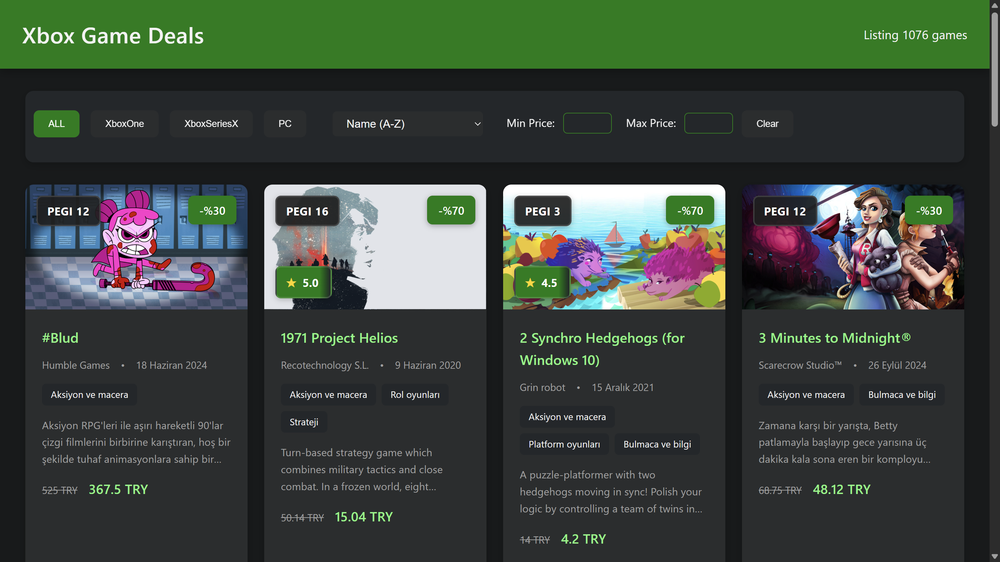

# Xbox Game Deals Scraper

> 
>
> <sub><sup>This is a screenshot of the main frontend page generated by the scraper. The UI is responsive, animated, and supports filtering/sorting.</sup></sub>

## ⚠️ Disclaimer

- **This project is NOT affiliated with Microsoft or Xbox.**
- Use this tool responsibly and for personal/non-commercial purposes only.
- Do not abuse or hammer the servers. The scraper includes random delays, but scraping too frequently may get you blocked or cause issues for others.

## Features

- Scrapes all available Xbox game deals for a given locale (e.g. `tr-TR`, `en-US`).
- Outputs a JSON file and a ready-to-use HTML page with all deals.
- The frontend supports filtering, sorting, price range, and more.
- Animations and responsive UI.

## Updates & Features

- **Robust error handling:** The scraper now gracefully handles Ctrl+C (SIGINT), unhandled promise rejections, and uncaught exceptions.
- **Image placeholder:** If a game has no image, a `placeholder.svg` is shown.
- **Performance:** The scraper uses randomized delays between requests (now 50–200ms) and generates a random `ms-cv` header for each API call.

## Usage

1. **Install dependencies:**

   ```bash
   npm install
   ```

2. **Set your language code:**

   - You can set the `LANG_CODE` environment variable (e.g. `tr-TR`, `en-US`).
   - Or, the script will prompt you for it on first run.

3. **Run the scraper:**

   ```bash
   node scraper.js
   ```

   or

   ```bash
   npm run scrape
   ```

4. **Output:**
   - `public/all_games.json` — All game data as JSON.
   - `public/index.generated.html` — Open this file in your browser to view the deals with filtering, sorting and basic UI.

## Notes

- The script adds random delays between requests to avoid hammering the Xbox servers.
- The output HTML is static and does not require a backend server.
- If you want to update the deals, simply re-run the scraper.

## Troubleshooting

- If you get blocked or see errors, wait a while before trying again.
- If the site structure changes, the scraper may need updates.

## License

This project is licensed under [MIT](LICENSE) license.
